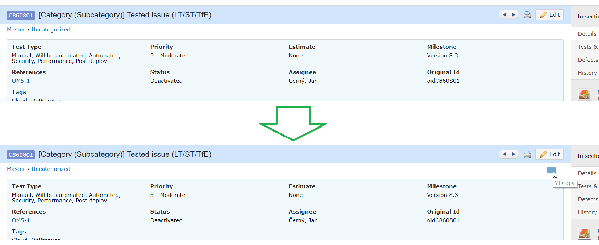

# TestRail-YTtestCase
This add-on injects JavaScript into TestRail web pages for copying YT Test Case Id. 

Compatible with TestRail *v5.6.0.3861* and lower.

After add-on:

## Release Notes
### v1.0.0.0
* bumped version

## Add-on for FireFox
[TestRail YTtestCase v1.0.0.0](https://addons.mozilla.org/cs/firefox/addon/testrail-yttestcase/)

## Add-on for Chrome 
* download file [TestRail YTtestCase v1.0.0.0](https://github.com/cernyjan/TestRail-YTtestCase/releases/tag/v1.0.0.0)
* extract it on the file system
* open Extensions page in browser
* click the “Developer mode” checkbox to activate it
* click the “Load unpacked extension” button
* Navigate to the extension’s directory and open it
